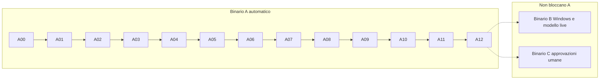

# Octo Core — Roadmap MVP (eseguibile)

Repository: https://github.com/francemazzi/octo_core

**Obiettivo:** realizzare un'app desktop Windows-first che documenta sessioni di lavoro autorizzate, mostra una mascotte sempre visibile durante la registrazione, ricostruisce le attività con poche domande all'utente ed esporta screenshot, brevi video e un report DOCX verificabile.

**Stato iniziale:** roadmap di sviluppo; nessuna funzionalità, verifica o fase è dichiarata completata. I comandi e i percorsi descritti sotto sono contratti da implementare, non file già presenti nel repository.

## Regola di esecuzione (senza pause)

1. **Binario A** è l'unica sequenza che sblocca la fase successiva. Ogni fase A si chiude con un test di integrazione deterministico verde su macOS, senza rete, senza chiavi di produzione, senza firma.
2. Se manca una decisione tecnica, vale la sezione [Decisioni congelate](#decisioni-congelate). Non fermarsi per chiedere conferma: si implementa secondo quella tabella e si registra un ADR se la scelta dipende dalla versione pinata in A01.
3. Se manca hardware Windows, certificato di firma, budget OpenRouter o una persona per approvazioni, si registra **`pending`** sul [Binario B](#binario-b--windows-e-modello-live) o [Binario C](#binario-c--documentazione-legale-e-pilot) e **si continua** sul binario A.
4. Una checkbox `[x]` significa implementazione presente **e** verifica riuscita. La chiusura di una fase A richiede `pnpm gate Axx` verde.

---

## 1. Risultato atteso e confini del prototipo

Il primo flusso completo deve essere:

```text
Installazione Windows
  → configurazione locale e selezione degli schermi
  → avvio esplicito della sessione
  → mascotte e controlli sempre disponibili
  → acquisizione locale di evidenze minimizzate
  → analisi dei segmenti autorizzati
  → domande contestuali limitate
  → revisione delle attività ricostruite
  → cartelle per attività, screenshot e clip
  → report DOCX con tempi, evidenze e opportunità da verificare
```

Il test dimostrativo iniziale riguarda una sessione di 60–90 minuti, un operatore, uno o due monitor e un processo di ufficio manifatturiero, per esempio l'inserimento di ordini da documenti in un gestionale. Le prime prove utilizzano esclusivamente dati fittizi.

**Incluso nell'MVP:** Windows 11 x64, acquisizione del contenuto visibile dei monitor selezionati o di una finestra, archivio locale, funzionamento offline della registrazione, analisi opzionale via OpenRouter, validazione umana, esportazione e stime economiche esplicitamente condizionate alle informazioni disponibili.

**Escluso dall'MVP:** controllo autonomo del PC, scrittura nei gestionali, invio di email, registrazione nascosta, keylogging, lettura della clipboard, audio e webcam, classifiche dei dipendenti, riconoscimento delle emozioni, training sui dati dei clienti, cloud multi-tenant, login SaaS, orchestrazione tra più dipendenti e supporto garantito a macOS, Linux, Citrix o Remote Desktop.

Acquisire tutto un monitor non significa leggere finestre mai aperte, database o contenuti protetti dal sistema operativo. Non aggirare permessi, schermate di sicurezza o restrizioni aziendali.

---

## 2. Tre binari



| Binario | Scopo | Blocca A? |
| --- | --- | --- |
| **A** | Implementazione e test deterministici (macOS / CI) | Sì — sequenza obbligatoria |
| **B** | Cattura reale, DPI, due monitor, installer, smoke OpenRouter | No — `pending` ammesso in manifest |
| **C** | Perimetro prodotto, legale, pilot, revisioni umane | No — checklist separata |

**Binario B** — suite `pnpm test:desktop:windows` e `pnpm test:model:live`. Lo stato `pending` nel manifest non fa fallire `pnpm gate:all`. Non autorizza a dichiarare «cattura reale pronta» o «modello live verificato» senza evidenza B.

**Binario C** — documenti in `docs/pilot/`, `docs/security/` e checklist pilot. La firma di un responsabile non è prerequisito di nessuna fase A. Richiesto solo da `pnpm gate:release`.

---

## 3. Contratto del test di integrazione

Ogni fase **A** termina con **un solo** file sotto `tests/integration/`:

| Fase | File di integrazione |
| --- | --- |
| A00 | `tests/integration/A00.oracle-fixtures.test.ts` |
| A01 | `tests/integration/A01.monorepo-gates.test.ts` |
| A02 | `tests/integration/A02.contracts-engine-process.test.ts` |
| A03 | `tests/integration/A03.sessions-schema.test.ts` |
| A04 | `tests/integration/A04.crypto-media-jobs.test.ts` |
| A05 | `tests/integration/A05.synthetic-capture-time.test.ts` |
| A06 | `tests/integration/A06.model-policy.test.ts` |
| A07 | `tests/integration/A07.episodes-questions.test.ts` |
| A08 | `tests/integration/A08.review-metrics-opportunities.test.ts` |
| A09 | `tests/integration/A09.docx-export.test.ts` |
| A10 | `tests/integration/A10.desktop-shell.test.ts` |
| A11 | `tests/integration/A11.video-capture-port.test.ts` |
| A12 | `tests/integration/A12.hardening-simulated.test.ts` |

Requisiti comuni:

- Importa moduli **reali** della fase. Fake solo ai bordi: schermo, rete, keystore OS, encoder hardware.
- Directory temporanea + fixture in `packages/test-fixtures/`. Guard che fallisce se il processo apre la rete (salvo test esplicitamente contrassegnati e fuori da `gate:all`).
- Nessun `test.skip` / `it.skip` nelle suite gate. `pnpm gate Axx` esegue quel file + i test unitari della fase elencati nel manifest.
- `pnpm gate:all` esegue solo i gate A presenti nel manifest — **non** include B né C.
- `pnpm gate:release` esige B, C e packaging; si usa in preparazione al pilot.
- Dopo il verde, registrare in `docs/testing/Axx.md`: commit, comando, ambiente, esito, limiti. Il test **non** scrive quel file a ogni run.

Per ogni attività completata usare evidenze sintetiche o prive di dati personali nei file versionati. Screenshot aziendali, registrazioni, database e chiavi non devono finire in Git o negli artefatti CI.

Non segnare come completata: verifica Windows eseguita solo su macOS come prova di cattura reale; mock del modello come prova del modello live; revisione legale come conseguenza di un test tecnico; funzione a pagamento senza chiamata autorizzata registrata in binario B.

---

## 4. Decisioni congelate

| Area | Decisione | Nota |
| --- | --- | --- |
| Workspace | pnpm workspaces, TypeScript `strict`, ESM | In A01: pin ultima stabile documentata di Electron, Electron Forge, React, Vite, Vitest, Zod, LangGraph.js, `docx`; ADR in `docs/adr/` |
| Motore | Processo Node figlio; messaggi JSON newline-delimited su stdin/stdout | Test avviano il motore senza Electron; main Electron = supervisore |
| IPC desktop | Preload tipizzato → main → stdio verso engine | Nessun accesso diretto del renderer a DB/chiavi |
| SQLite | Preferire `node:sqlite` del Node bundled con Electron scelto; altrimenti `better-sqlite3` + rebuild in ADR | Scelta unica in A01 |
| Chiavi | AES-256-GCM; interfaccia `KeyProvider` | Test: chiave in memoria; produzione: `safeStorage` avvolge data-key [S4]. Keystore assente → registrazione non parte |
| Cattura | `CaptureAdapter`; default test/dev: `SyntheticCaptureAdapter` (`OCTO_CAPTURE=synthetic`) | `ElectronDesktopCaptureAdapter` in A11. Due monitor non supportati → capability `single_monitor` esplicita; il binario A continua |
| Video | Porta `MediaEncoder`; test scrive contenitore deterministico senza audio | Codec reale = binario B |
| Analisi | `ModelAdapter` senza tool shell/file/rete; default `local_only`; LangGraph checkpointer su SQLite; mock da fixture | Live = binario B |
| Export | Identificatori codice in inglese; path utente in italiano | Vedi [Mapping export](#mapping-export-codice-vs-percorsi-utente) |
| Tempo | Due monitor osservati insieme **non** raddoppiano il tempo umano | Unione intervalli; oracolo in fixture A00 |
| HTTP | Fastify solo se un client concreto lo richiede | Nessun backend remoto obbligatorio per MVP |

Il motore deve poter essere testato senza Electron e senza Internet. Il renderer non importa direttamente filesystem, database, chiavi o SDK dei modelli. Non costruire microservizi, Redis o un database a grafo per questo MVP.

### Struttura prevista

```text
apps/
  desktop/
    src/main/
    src/preload/
    src/renderer/
    src/capture-renderer/
  engine/
    src/domain/
    src/jobs/
    src/analysis/
    src/storage/
    src/reports/
packages/
  contracts/
  capture-adapter/
  test-fixtures/
native/
  windows-context/
docs/
  adr/
  testing/
  security/
  pilot/
scripts/
  gates/
tests/
  integration/
  replay/
  desktop/
  live-model/
  performance/
```

### Mapping export (codice vs percorsi utente)

| Codice / schema | Path in export |
| --- | --- |
| `activity.json` | `attivita/<tipo>/<episodio>/activity.json` |
| `session-summary.docx` (ReportModel) | `report/riepilogo-sessione.docx` |
| `unclassified/` | `da-verificare/` |
| `index.html` | `indice.html` |

---

## 5. Comandi gate

Implementati in **A01**; fino ad allora sono contratto.

```bash
pnpm install --frozen-lockfile
pnpm lint
pnpm typecheck
pnpm test:unit
pnpm test:integration
pnpm test:replay
pnpm gate Axx          # Una fase A (es. pnpm gate A05)
pnpm gate:all          # Tutte le fasi A nel manifest — esclude B e C
pnpm gate:release      # Pilot: include test:desktop:windows, test:model:live, checklist C, package:win
```

Il manifest in `scripts/gates/` associa ogni `Axx` al file di integrazione e ai test unitari. Un gate A fallisce se manca il test, c'è uno skip, o manca `docs/testing/Axx.md` **dopo** la prima chiusura della fase (il manifest può richiedere solo il file di integrazione finché la fase non è mai stata chiusa — alla prima chiusura si crea la evidenza).

CI (da A01): lint, typecheck, unit, integration, replay, `gate:all`. Secret scan e allowlist artefatti; nessun video o DB reale caricato per default.

---

## 6. Modello dati e invarianti

| Entità | Contenuto minimo |
| --- | --- |
| `Project` | Contesto locale, finalità, policy di raccolta, tassonomia e retention |
| `Session` | Operatore pseudonimo, inizio/fine, stato, scope, versione della policy |
| `CaptureSource` | Monitor/finestra autorizzati, geometria, scala DPI, intervalli di validità |
| `CaptureEvent` | Timestamp, offset monotono, sequenza, avvio/pausa/blocco/errore/cambio configurazione |
| `Evidence` | Asset ID, sorgente, intervallo, hash, maschere applicate, stato di disponibilità |
| `ActivityType` | Categoria condivisa nel progetto, descrizione e versione |
| `ActivityEpisode` | Esecuzione specifica, eventuale case ID pseudonimo, obiettivo, stato della review |
| `EpisodeInterval` | Intervalli anche discontinui assegnati a un episodio e provenienza dell'assegnazione |
| `Question` / `Answer` | Domanda, evidenze, risposta, rinvio, versione e revisione risultante |
| `AnalysisRun` | Modello, provider, prompt/schema, evidenze in input, esito e consumi disponibili |
| `Opportunity` | Problema, evidenze, alternativa proposta, ipotesi economiche, verifiche mancanti |
| `ReportVersion` | Snapshot del dataset validato, autore della revisione, sezioni e artefatti |
| `Job` / `AuditEvent` | Stato, retry, lease, idempotenza, cancellazione e operazioni rilevanti |

Invarianti obbligatorie:

- Gli orari leggibili e gli offset della sessione sono entrambi conservati. Ogni riavvio del processo apre una nuova epoca del clock; non sottrarre timestamp monotoni provenienti da epoche differenti.
- Due monitor osservati contemporaneamente non raddoppiano il tempo umano. Le durate usano unioni di intervalli.
- Uno screenshot duplicato può essere eliminato, ma non la durata della situazione che rappresenta.
- Cambio applicazione e cambio attività non sono equivalenti. Un episodio può essere interrotto e ripreso.
- Ogni intervallo conteggiato nel totale ha una sola assegnazione primaria oppure è `unknown`; etichette secondarie non aggiungono tempo.
- Tempo inattivo del computer, tempo trascorso, attesa confermata e lavoro evitabile sono concetti distinti.
- I confini inferiti da fotogrammi campionati hanno precisione limitata: registrare provenienza e risoluzione temporale, senza falsa precisione al millisecondo.
- Ogni conclusione deve rimandare a evidenze esistenti o essere etichettata come dichiarazione dell'utente/ipotesi. L'AI non può dichiarare autonomamente un'attività `confirmed`.
- La revoca o eliminazione di un'evidenza invalida i derivati interessati. Un job in esecuzione non può ricreare dati cancellati.
- I dati osservati non costituiscono automaticamente un dataset autorizzato per training o riuso fra clienti.

### Modalità dati (AI)

| Modalità | Comportamento |
| --- | --- |
| `local_only` | Predefinita: nessuna evidenza inviata ai modelli remoti |
| `cloud_after_review` | Solo evidenze approvate in revisione |
| `cloud_live_authorized` | Invio durante sessione nel perimetro autorizzato |

---

## Fase A00 — Oracolo e perimetro documentale

**Dipendenze:** nessuna (prima fase).

**Obiettivo:** fixture versionate come unica fonte di verità per replay, tempo ed economia; documenti di perimetro non bloccano il codice ma devono esistere prima del pilot (binario C).

- [x] **A00.01 — Contratto MVP.** `docs/pilot/mvp-scope.md`: persona, processo demo, OS, monitor, dati, deliverable, inclusioni/esclusioni.
- [x] **A00.02 — Matrice modalità dati.** `docs/security/data-modes.md`: cosa può lasciare il PC per ogni modalità; `local_only` ≠ AI locale se non implementata.
- [x] **A00.03 — Threat model.** `docs/security/threat-model.md`: screenshot, notifiche, titoli, video, chiavi, log, checkpoint, export, cancellazione; mitigazione o rischio residuo per superficie.
- [x] **A00.04 — Fixture sessione.** `packages/test-fixtures/session-oracle.json`: ordine A, interruzione B, ritorno A, ricerca codice, attesa dichiarata, tratto `unknown`, due sorgenti monitor; timeline attesa e durate (unione intervalli).
- [x] **A00.05 — Fixture economica.** `packages/test-fixtures/economics-oracle.json`: stessi numeri della [sezione 12](#12-fixture-economica-di-riferimento) con decimali JSON (`0.70`).
- [x] **A00.06 — Schema Zod delle fixture.** Validazione in `packages/contracts/` o `packages/test-fixtures/`.
- [x] **A00.G — Gate A00.** `pnpm gate A00` verde.

**Test di integrazione:** `tests/integration/A00.oracle-fixtures.test.ts` — valida schema; calcola durate attese (no doppio conteggio multi-monitor); ROI, payback e ore potenziali uguali all'oracolo economico.

---

## Fase A01 — Monorepo e infrastruttura gate

**Dipendenze:** A00.

- [x] **A01.01 — Workspace.** pnpm, TS strict, ESLint, Prettier, lockfile; ADR versioni pin.
- [x] **A01.02 — Vitest.** Unit + integration; alias pacchetti.
- [x] **A01.03 — Manifest gate.** `scripts/gates/manifest.json`: mappa `Axx` → test integrazione + unit; distingue `automatic`, `hardware`, `human`.
- [x] **A01.04 — Script `pnpm gate`.** Fallisce su test mancante o skip nella fase richiesta.
- [x] **A01.05 — CI.** Workflow lint, typecheck, unit, integration, replay, `gate:all`; no `.env`/runtime in artefatti.
- [x] **A01.06 — Secret scan fixture.** Pattern noti falliscono la CI se commessi.
- [x] **A01.G — Gate A01.** `pnpm gate A01` verde; `pnpm gate:all` eseguibile (solo fasi già implementate nel manifest).

**Test di integrazione:** `tests/integration/A01.monorepo-gates.test.ts` — `gate A01` passa; simulazione fase assente o skip fa fallire solo quel gate, non l'infrastruttura globale.

---

## Fase A02 — Contratti e processo motore

**Dipendenze:** A01.

- [x] **A02.01 — Pacchetto `contracts`.** Zod per comandi, eventi, errori, versione protocollo.
- [x] **A02.02 — Bootstrap engine.** Entry `apps/engine`; readline JSON su stdin/stdout.
- [x] **A02.03 — Handshake e shutdown.** Versione, capabilities, chiusura ordinata.
- [x] **A02.04 — Interfacce porte.** `CaptureAdapter`, `ModelAdapter`, `MediaStore`, `Clock`, repository (stub).
- [x] **A02.G — Gate A02.** `pnpm gate A02` verde.

**Test di integrazione:** `tests/integration/A02.contracts-engine-process.test.ts` — client finto → stdin → engine → stdout; payload malformato e versione incompatible rifiutati; kill processo figlio osservabile dal supervisore finto.

---

## Fase A03 — Sessioni, schema e clock

**Dipendenze:** A02.

- [x] **A03.01 — Migrazioni SQLite.** Entità §6, FK, indici.
- [x] **A03.02 — Macchina a stati.** Cattura vs analisi separati; analisi pendente ≠ registrazione attiva.
- [x] **A03.03 — Clock a epoche.** Offset monotono per epoca processo.
- [x] **A03.G — Gate A03.** `pnpm gate A03` verde.

**Test di integrazione:** `tests/integration/A03.sessions-schema.test.ts` — start ripetuto non duplica sessione; transizione invalida rifiutata; simulazione cambio ora wall-clock non produce durata negativa sugli offset di sessione.

---

## Fase A04 — Cifratura, media store e job

**Dipendenze:** A03.

- [x] **A04.01 — `KeyProvider` + AES-GCM.** Implementazione test `InMemoryKeyProvider`; doc limiti metadati in chiaro.
- [x] **A04.02 — Media store transazionale.** Scritture atomiche, hash, manifest, asset incompleti.
- [x] **A04.03 — Job durevoli.** Lease, retry, backoff, cancel, idempotenza.
- [x] **A04.04 — Quote e retention.** Pausa e avviso a soglia disco; no cancellazione silenziosa report approvati.
- [x] **A04.G — Gate A04.** `pnpm gate A04` verde.

**Test di integrazione:** `tests/integration/A04.crypto-media-jobs.test.ts` — manomissione ciphertext rilevata; interruzione mid-write non lascia evidenza `valid`; restart job non duplica effetto; cancel concorrente non resuscita righe eliminate.

---

## Fase A05 — Cattura sintetica, maschere e tempo

**Dipendenze:** A04.

- [x] **A05.01 — `SyntheticCaptureAdapter`.** Replay da `session-oracle.json`.
- [x] **A05.02 — Selezione sorgenti.** Solo sorgenti autorizzate producono asset.
- [x] **A05.03 — Pipeline pre-persist.** Maschere → minimizzazione → cifratura → store.
- [x] **A05.04 — Fotogrammi e durata.** Dedup frame; durata tratti stabili conservata.
- [x] **A05.05 — Gap ed errori.** Stream terminated, pause, backpressure distinguibili.
- [x] **A05.06 — Contesto app opzionale.** Adapter no-op se indisponibile.
- [x] **A05.G — Gate A05.** `pnpm gate A05` verde.

**Test di integrazione:** `tests/integration/A05.synthetic-capture-time.test.ts` — fixture A00 attraverso adapter; totali tempo = oracolo; pattern sensibili assenti; zero asset da sorgente non selezionata.

---

## Fase A06 — Policy modello e adapter mock

**Dipendenze:** A05 (A04 per job).

- [x] **A06.01 — `ModelAdapter` mock.** Output JSON da fixture; budget e timeout.
- [x] **A06.02 — Pacchetti evidenze.** Limiti dimensione; solo ID esistenti.
- [x] **A06.03 — Schema output.** Rifiuto evidenze inesistenti, durate inventate, fuori sessione.
- [x] **A06.04 — Tre modalità.** Enforcement rete in `local_only` e scope in `cloud_after_review`.
- [x] **A06.05 — Prompt injection fixture.** Nessun tool al modello.
- [x] **A06.06 — Confine locale.** Modelli cloud di Ollama mai usati in `local_only` (analisi e OCR); gate sul cablaggio reale (`modelWiring`).
- [x] **A06.07 — Risposte e sessioni lunghe.** Id inventati o doppi rifiutati con `issues`; analisi a blocchi con continuazione delle attività e run parziale esplicito.
- [x] **A06.G — Gate A06.** `pnpm gate A06` verde.

**Test di integrazione:** `tests/integration/A06.model-policy.test.ts` — spy rete: zero chiamate in `local_only`; solo evidenze approved verso mock in `cloud_after_review`; JSON invalido rifiutato; injection non cambia policy/scope.

---

## Fase A07 — LangGraph, episodi e domande

**Dipendenze:** A06.

- [x] **A07.01 — Grafo analisi.** Preparazione → interpretazione → episodio → domanda → consolidamento.
- [x] **A07.02 — Checkpointer SQLite.** `thread_id` = progetto/sessione/versione.
- [x] **A07.03 — Episodi interrotti.** A → B → A; tempi separati.
- [x] **A07.04 — Quota domande.** Max 3 proattive/giorno default; cooldown; rinvio.
- [x] **A07.05 — Interrupt/risposte.** Risposte tardive o cross-episodio ignorate o quarantine.
- [x] **A07.06 — Memoria correzioni progetto.** Revocabile; no training cross-client.
- [x] **A07.G — Gate A07.** `pnpm gate A07` verde.

**Test di integrazione:** `tests/integration/A07.episodes-questions.test.ts` — replay fixture: A/B tempi corretti; restart grafo senza domande duplicate; registrazione (simulata) non blocked on model.

---

## Fase A08 — Revisione, metriche, opportunità

**Dipendenze:** A07.

- [x] **A08.01 — Editor episodi.** Split, merge, riassign, confirm; transazioni + storico.
- [x] **A08.02 — Calcolo durate.** Unioni/intersezioni; pause, gap, unknown.
- [x] **A08.03 — `activity.json` canonico.** Schema validato; nomi file non decisi dal modello.
- [x] **A08.04 — Opportunity + formule economiche.** Input mancanti = `unknown`.
- [x] **A08.05 — Esclusioni retroattive.** Invalidazione derivati; job non ricrea eliminati.
- [x] **A08.G — Gate A08.** `pnpm gate A08` verde.

**Test di integrazione:** `tests/integration/A08.review-metrics-opportunities.test.ts` — split/merge senza overlap primario; economics-oracle → 560 h, 11760 EUR capacità, ROI ~30.6667%, payback ~8.22 mesi; input assente resta `unknown`.

---

## Fase A09 — ReportModel, DOCX ed export cartelle

**Dipendenze:** A08 (clip opzionali — non richiede video).

- [x] **A09.01 — ReportModel versionato.** Snapshot unico per UI/JSON/DOCX.
- [x] **A09.02 — Generazione DOCX.** Libreria `docx` [S9]; bozza vs approvato.
- [x] **A09.03 — Export tree.** Mapping § mapping export; `indice.html` statico escapato.
- [x] **A09.04 — Path safety.** Traversal, nomi ostili, destinazione esplicita.
- [x] **A09.05 — Dati mancanti.** Clip assenti dichiarate; rigenerazione = nuova versione.
- [x] **A09.G — Gate A09.** `pnpm gate A09` verde.

**Test di integrazione:** `tests/integration/A09.docx-export.test.ts` — stesso snapshot → JSON + tree + DOCX coerenti; path traversal fallisce; assenza clip esplicita nel report.

**Nota:** revisione visiva Word su Windows = binario B/C, non gate A09.

---

## Fase A10 — Shell desktop (Electron + sintetico)

**Dipendenze:** A09 (motore e contratti da A02–A08).

- [x] **A10.01 — Electron Forge scaffold.** Main, preload, renderer, capture-renderer placeholder.
- [x] **A10.02 — Onboarding.** Nessuna registrazione prima di comando esplicito.
- [x] **A10.03 — Mascotte e controlli.** Start/pausa/stop → engine reale via IPC/main.
- [x] **A10.04 — Sicurezza Electron.** Sandbox, contextIsolation, CSP, IPC allowlist [S3].
- [x] **A10.05 — Chiusura app.** Termina sessione e stream.
- [x] **A10.06 — Adapter cattura collegato.** `OCTO_CAPTURE=synthetic` default in test.
- [x] **A10.07 — Logo nell'angolo.** Finestra trasparente in alto a destra, Pausa/Riprendi e Stop al passaggio, badge domande.
- [x] **A10.08 — Sessioni per giorno.** Barra laterale con titolo, attività e riassunti; sessione attiva o avvio.
- [ ] **A10.09 — Etichette nei report.** Usare nome e riassunto delle attività nel mini report e nel DOCX.
- [x] **A10.10 — Chiave OpenRouter dall'app.** Impostazioni con chiave in `safeStorage`; "Analizza con OpenRouter" per sessione, con conferma e approvazione registrata.
- [x] **A10.G — Gate A10.** `pnpm gate A10` verde.

**Test di integrazione:** `tests/integration/A10.desktop-shell.test.ts` — Electron in test (es. Playwright): start → pausa → stop; chiusura app termina sessione; nessun asset con timestamp acquisizione dopo pausa.

**Binario B:** mascotte durante uso altre app; `setContentProtection` esclusione da cattura [S3].

---

## Fase A11 — Video e porta cattura Electron

**Dipendenze:** A10.

- [x] **A11.01 — `MediaEncoder` deterministico.** Test container senza audio.
- [x] **A11.02 — Segmenti incompleti.** Marcati non validi; manifest recupero [S5].
- [x] **A11.03 — Clip per intervallo.** Riferimenti temporali; tolleranza documentata.
- [x] **A11.04 — `ElectronDesktopCaptureAdapter`.** Implementazione dietro stessa interfaccia di A05.
- [x] **A11.05 — Packaging dev.** Pacchetto senza Node sul target (binario B per verifica su PC pulito).
- [x] **A11.G — Gate A11.** `pnpm gate A11` verde.

**Test di integrazione:** `tests/integration/A11.video-capture-port.test.ts` — frame sintetici minimizzati → media senza audio; segmento non finalizzato ≠ valid.

**Binario B:** `tests/desktop/` — cattura reale, 1080p/4K, DPI, due monitor, riproduzione su secondo PC.

---

## Fase A12 — Hardening simulato e pacchetto dev

**Dipendenze:** A11.

- [x] **A12.01 — Fault injection simulata.** Engine kill, disco pieno, offline rete.
- [x] **A12.02 — Cancellazione perimetro.** Marker sintetici assenti post-delete; job non ricrea.
- [x] **A12.03 — Diagnostica.** Log senza pixel; guida stop/revoca/cancel.
- [x] **A12.04 — `package:win` dev.** Non firmato; hash build registrato.
- [x] **A12.G — Gate A12.** `pnpm gate A12` verde.

**Test di integrazione:** `tests/integration/A12.hardening-simulated.test.ts` — disco pieno → pausa senza wipe report approvati; offline → job AI queued; post-cancellazione scan marker vuoto.

**Binario B/C:** benchmark 2 h, firma Authenticode [S11], audit dipendenze critiche — solo `gate:release`.

---

## Binario B — Windows e modello live

**Non blocca il binario A.** Stato iniziale consigliato: `pending`. Evidenze in `docs/testing/B.md`.

| ID | Verifica | Suite / comando |
| --- | --- | --- |
| B01 | Cattura finestra e monitor; renderer non autorizzato rifiutato [S1,S2] | `tests/desktop/capture.test.ts` |
| B02 | Due stream distinti; no race globale | `tests/desktop/dual-monitor.test.ts` |
| B03 | DPI, 4K, coordinate negative | `tests/desktop/dpi.test.ts` |
| B04 | Mascotte esclusa da frame catturati [S3] | `tests/desktop/mascot-exclusion.test.ts` |
| B05 | Install dev su PC senza Node; SQLite packaged | `pnpm package:win` + manuale |
| B06 | Smoke OpenRouter sintetico; tetto costo; `LIVE_PENDING` se assente | `pnpm test:model:live` |
| B07 | Export riprodotto su secondo PC Windows | checklist B |
| B08 | Revisione visiva DOCX in Word | checklist B |

Se due monitor non sono stabili: capability `single_monitor` in produzione; B02 resta `failed` o `skipped` con ADR, **senza** riaprire A05–A10.

---

## Binario C — Documentazione, legale e pilot

**Non blocca il binario A.** Richiesto per `pnpm gate:release` e dati aziendali reali.

| ID | Contenuto | Stato |
| --- | --- | --- |
| C01 | Revisione perimetro prodotto+tecnico (ex P00.G) | pending |
| C02 | Gate dati aziendali: checklist nominativa referente (ex P00.06) | pending |
| C03 | Scheda hardware Windows 11 rappresentativo (ex P00.05) | pending |
| C04 | Pilot sintetico 60–90 min, annotatore indipendente (ex P13.01) | pending |
| C05 | Pilot aziendale formalizzato (ex P13.02) | pending |
| C06 | Metriche riconoscimento holdout (ex P13.03) — **non** gate A | pending |
| C07 | Carico operatore review (ex P13.04) | pending |
| C08 | Costo report approvato (ex P13.05) | pending |
| C09 | Opportunità concreta con process owner (ex P13.06) | pending |
| C10 | Decisione GO / REVISE / STOP (ex P13.07) | pending |
| C11 | Revisione umana ≥3 business case sintetici (ex P10.G) | pending |

Macro-F1 ≥ 0,80 sul modello reale è **indicatore pilot** (C06), non criterio di `gate:all`.

---

## 7. Milestone (binario A)

| Milestone | Fasi A | Cosa si dimostra (automatico) |
| --- | --- | --- |
| **M0 — Flusso sintetico** | A00–A05 | Oracolo, archivio, cattura sintetica e tempo corretto |
| **M1 — Intelligenza e dataset** | A06–A09 | Policy AI mock, episodi, review, DOCX/export |
| **M2 — Desktop e hardening** | A10–A12 | Shell Electron, video/porta reale, fault simulati |

Il **pilot utilizzabile** (M4 storico) = A12 verde + `gate:release` (B + C). Procedere per gate A, non per data fissa.

---

## 8. Soglie iniziali da validare

Soglie di progetto, non garanzie. Congelare in A00 o modificare con ADR.

| Indicatore | Obiettivo iniziale | Misura |
| --- | --- | --- |
| Evidenze fuori scope | Zero | Fixture + audit asset (A05) |
| Rete AI in `local_only` | Zero richieste | A06 + binario B |
| Screenshot in pausa/blocco | Zero per timestamp acquisizione | A05, A10 |
| Accounting tempo | Nessun doppio conteggio | A00, A05, A08 |
| Domande proattive | Max 3/giorno default | A07 |
| Copertura sessione | ≥ 95% nel benchmark concordato | Binario B |
| Classificazione automatica | Macro-F1 ≥ 0,80 holdout piccolo | Binario C / pilot |
| Reattività controlli | UI 250 ms p95; stop cattura 1 s p95 | Binario B |
| Review sessione | ≤ 10 min per 60–90 min acquisiti | Binario C |
| Stabilità | 2 h senza crash / leak silenzioso | Binario B |
| Attendibilità report | Affermazioni collegate a evidenze | A08, A09, C |

---

## 9. Replay

`pnpm test:replay` esegue scenari deterministici da `tests/replay/` usando fixture A00 e adapter mock. Obbligatorio in CI da A01. Complementa ma non sostituisce il test di integrazione di fase.

---

## 10. Backlog successivo (non MVP)

- [ ] **E01 — Contesto Windows avanzato.** UI Automation [S10].
- [ ] **E02 — Modello locale.**
- [ ] **E03 — Aggregazione fra operatori.**
- [ ] **E04 — Backend condiviso (Fastify + PostgreSQL).**
- [ ] **E05 — Connettori documentali.**
- [ ] **E06 — Specifiche automazione esterna.**
- [ ] **E07 — Misurazione prima/dopo.**
- [ ] **E08 — Libreria processi riutilizzabili.**
- [ ] **E09 — macOS / Linux.**

---

## 11. Checklist `gate:release`

- [ ] `pnpm gate:all` verde su commit/tag release.
- [ ] Binario B: evidenze B01–B08 non `pending` (o limiti dichiarati in ADR).
- [ ] Binario C: C01–C04 minimo per pilot sintetico; C02 obbligatorio per dati reali.
- [ ] Installer hash documentato; firma se policy IT lo richiede.
- [ ] Nessun dato aziendale in Git/CI; funzionalità sperimentali etichettate.

---

## 12. Fixture economica di riferimento

Valori per `economics-oracle.json` e test A08 (decimali con **punto** in JSON):

```text
volume_annuo = 12000
quota_coperta = 0.70
tempo_prima_min = 6
tempo_dopo_min = 2
costo_orario_eur = 30
fattore_utilizzo_capacita = 0.70
investimento_eur = 6000
costi_ricorrenti_annui_eur = 3000

ore_potenziali = 12000 * 0.70 * (6 - 2) / 60 = 560
valore_capacita_eur = 560 * 30 * 0.70 = 11760
beneficio_netto_annuo_eur = 11760 - 3000 = 8760
ROI_anno_1 = (11760 - 6000 - 3000) / 9000 = 0.306667 (30.6667%)
payback_mesi = 6000 / (8760 / 12) ≈ 8.22
```

Capacità utilizzabile, non risparmio di cassa garantito. Payback `non_raggiunto` se beneficio netto mensile ≤ 0.

---

## 13. Corrispondenza Pxx → Axx (legacy)

| Vecchio | Nuovo | Nota |
| --- | --- | --- |
| P00 | A00 + binario C | Documenti perimetro; oracle in A00 |
| P01 | A01, A02 | Monorepo vs contratti/engine |
| P02 | A11 + binario B | Spike Windows spostato; sintetico prima in A05 |
| P03 | A03, A04 | Schema/sessioni vs crypto/job |
| P04 | A10 + B | UI desktop |
| P05 | A05 | Cattura/tempo sintetico |
| P06 | A11 + B | Video |
| P07 | A06 + B live | OpenRouter |
| P08 | A07 | LangGraph |
| P09, P10 | A08 | Review + metriche + economics |
| P11 | A09 | DOCX/export |
| P12 | A12 + B/C | Hardening + release |
| P13 | Binario C | Pilot |

---

## 14. Riferimenti tecnici

- **[S1]** Electron desktopCapturer: https://www.electronjs.org/docs/latest/api/desktop-capturer
- **[S2]** Electron Session: https://www.electronjs.org/docs/latest/api/session
- **[S3]** Electron BrowserWindow: https://www.electronjs.org/docs/latest/api/browser-window
- **[S4]** Electron safeStorage: https://www.electronjs.org/docs/latest/api/safe-storage
- **[S5]** MediaRecorder: https://developer.mozilla.org/en-US/docs/Web/API/MediaRecorder
- **[S6]** LangGraph.js interrupts: https://docs.langchain.com/oss/javascript/langgraph/interrupts
- **[S7]** OpenRouter provider selection: https://openrouter.ai/docs/guides/routing/provider-selection
- **[S8]** OpenRouter structured outputs: https://openrouter.ai/docs/guides/features/structured-outputs
- **[S9]** docx: https://docx.js.org/
- **[S10]** UI Automation: https://learn.microsoft.com/en-us/windows/win32/winauto/uiauto-uiautomationoverview
- **[S11]** Electron Forge signing: https://www.electronforge.io/guides/code-signing/code-signing-windows
